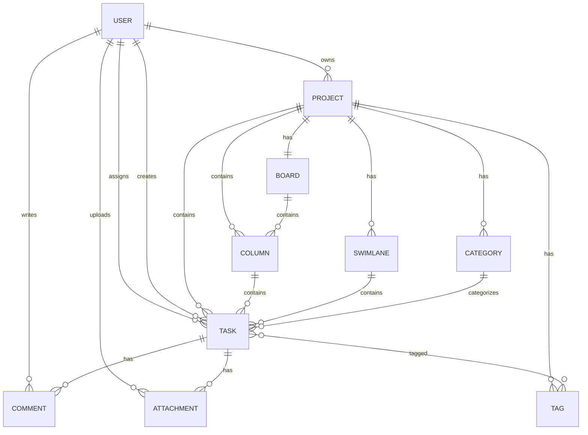

# Data Entities

## Panoramica

Questo documento descrive tutte le entità dati utilizzate nell'applicazione TaskManager e le loro relazioni. Le entità rappresentano i concetti fondamentali del dominio Kanban.

## Entità e Relazioni

### 1. User (Utente)

L'entità User rappresenta un utente registrato nel sistema.

**Descrizione:**
Gli utenti sono i soggetti che interagiscono con il sistema. Possono creare progetti, essere assegnatari di task, commentare e collaborare con altri utenti.

**Proprietà:**

- `Id`: Identificatore univoco dell'utente
- `Username`: Nome utente univoco
- `Email`: Indirizzo email dell'utente
- `PasswordHash`: Hash della password per l'autenticazione
- `Role`: Ruolo dell'utente nel sistema (es. Admin, User)
- `CreatedAt`: Data e ora di registrazione
- `Theme`: Preferenza del tema dell'interfaccia
- `TimeZone`: Fuso orario dell'utente
- `IsActive`: Indica se l'utente è attivo o disattivato

### 2. Project (Progetto)

L'entità Project rappresenta un progetto Kanban che contiene task e board.

**Descrizione:**
I progetti sono contenitori per attività correlate. Ogni progetto ha una board Kanban associata e può essere condiviso con altri utenti.

**Proprietà:**

- `Id`: Identificatore univoco del progetto
- `Name`: Nome del progetto
- `Description`: Descrizione dettagliata del progetto
- `Identifier`: Codice identificativo leggibile (es. "PROJ-001")
- `OwnerId`: ID dell'utente proprietario del progetto
- `IsActive`: Indica se il progetto è attivo
- `IsPrivate`: Indica se il progetto è privato o pubblico
- `StartDate`: Data di inizio pianificata
- `EndDate`: Data di fine pianificata
- `TaskLimit`: Limite massimo di task per il progetto
- `CreatedAt`: Data e ora di creazione
- `ModifiedAt`: Data e ora dell'ultima modifica

### 3. Board (Board Kanban)

L'entità Board rappresenta la board Kanban associata a un progetto.

**Descrizione:**
La board è la vista principale di un progetto Kanban, composta da colonne e swimlane dove i task vengono organizzati e gestiti.

**Proprietà:**

- `Id`: Identificatore univoco della board
- `Name`: Nome della board (solitamente uguale al nome del progetto)
- `ProjectId`: ID del progetto associato
- `CreatedAt`: Data e ora di creazione

### 4. Column (Colonna)

L'entità Column rappresenta una colonna nella board Kanban.

**Descrizione:**
Le colonne rappresentano stati o fasi del workflow (es. "To Do", "In Progress", "Done"). I task vengono spostati tra colonne per rappresentare il progresso.

**Proprietà:**

- `Id`: Identificatore univoco della colonna
- `Title`: Titolo della colonna
- `Position`: Posizione ordinale della colonna nella board
- `ProjectId`: ID del progetto associato
- `TaskLimit`: Limite massimo di task consentiti nella colonna
- `Description`: Descrizione della colonna
- `HideInDashboard`: Indica se la colonna deve essere nascosta nella dashboard

### 5. Task (Task/Attività)

L'entità Task rappresenta un'attività o lavoro da completare.

**Descrizione:**
I task sono le unità fondamentali di lavoro in un progetto Kanban. Possono essere assegnati a utenti, avere scadenze, commenti e allegati.

**Proprietà:**

- `Id`: Identificatore univoco del task
- `Title`: Titolo del task
- `Description`: Descrizione dettagliata del task
- `ProjectId`: ID del progetto associato
- `ColumnId`: ID della colonna corrente
- `AssigneeId`: ID dell'utente assegnatario (opzionale)
- `CreatorId`: ID dell'utente che ha creato il task
- `Position`: Posizione ordinale del task nella colonna
- `Priority`: Priorità del task (Low, Normal, High, Urgent)
- `DueDate`: Data e ora di scadenza (opzionale)
- `CreatedAt`: Data e ora di creazione
- `ModifiedAt`: Data e ora dell'ultima modifica
- `TimeEstimated`: Tempo stimato per il completamento in minuti (opzionale)
- `TimeSpent`: Tempo effettivamente speso in minuti (opzionale)

### 6. Comment (Commento)

L'entità Comment rappresenta un commento su un task.

**Descrizione:**
I commenti permettono agli utenti di discutere e collaborare sui task specifici.

**Proprietà:**

- `Id`: Identificatore univoco del commento
- `TaskId`: ID del task associato
- `UserId`: ID dell'utente autore del commento
- `Content`: Contenuto del commento
- `CreatedAt`: Data e ora di creazione
- `Visibility`: Visibilità del commento (Public, Private, etc.)

### 7. Category (Categoria)

L'entità Category rappresenta una categoria per i task di un progetto.

**Descrizione:**
Le categorie permettono di raggruppare i task logicamente all'interno di un progetto.

**Proprietà:**

- `Id`: Identificatore univoco della categoria
- `Name`: Nome della categoria
- `ProjectId`: ID del progetto associato
- `Description`: Descrizione della categoria
- `Color`: Colore associato alla categoria per identificazione visiva

### 8. Tag (Etichetta)

L'entità Tag rappresenta un'etichetta per i task di un progetto.

**Descrizione:**
I tag sono etichette personalizzabili che possono essere applicate ai task per categorizzarli o filtrarli.

**Proprietà:**

- `Id`: Identificatore univoco del tag
- `Name`: Nome del tag
- `ProjectId`: ID del progetto associato
- `Color`: Colore associato al tag per identificazione visiva

### 9. TaskTag (Relazione Task-Tag)

L'entità TaskTag rappresenta la relazione many-to-many tra Task e Tag.

**Descrizione:**
Questa entità permette a un task di avere molti tag e a un tag di essere applicato a molti task.

**Proprietà:**

- `TaskId`: ID del task
- `TagId`: ID del tag

### 10. Swimlane (Corsia)

L'entità Swimlane rappresenta una riga orizzontale nella board Kanban.

**Descrizione:**
Le swimlane permettono di organizzare i task per utente, priorità o altre dimensioni oltre alle colonne verticali.

**Proprietà:**

- `Id`: Identificatore univoco della swimlane
- `Name`: Nome della swimlane
- `ProjectId`: ID del progetto associato
- `Position`: Posizione ordinale della swimlane nella board
- `IsActive`: Indica se la swimlane è attiva
- `TaskLimit`: Limite massimo di task consentiti nella swimlane

### 11. Attachment (Allegato)

L'entità Attachment rappresenta un file allegato a un task.

**Descrizione:**
Gli allegati permettono di associare file a task per fornire informazioni aggiuntive o documentazione.

**Proprietà:**

- `Id`: Identificatore univoco dell'allegato
- `TaskId`: ID del task associato
- `FileName`: Nome del file
- `FilePath`: Percorso di archiviazione del file
- `FileSize`: Dimensione del file in byte
- `UploadedAt`: Data e ora di caricamento
- `UploadedById`: ID dell'utente che ha caricato il file

## Diagramma delle Relazioni

## Considerazioni sulle Relazioni

1. **Integrità Referenziale**: Tutte le relazioni foreign key sono implementate per garantire l'integrità dei dati.

2. **Cascading Operations**: Alcune operazioni di cancellazione avvengono in cascata (es. cancellazione di un progetto cancella anche le sue colonne e task).

3. **Indicizzazione**: Le proprietà utilizzate frequentemente nelle query sono indicizzate per migliorare le performance.

4. **Vincoli di Unicità**: Dove appropriato, sono stati aggiunti vincoli di unicità (es. Username, Email per gli utenti).

## Futura Implementazione

L'implementazione di queste entità seguirà l'approccio della Clean Architecture con Entity Framework Core per la persistenza dati.
