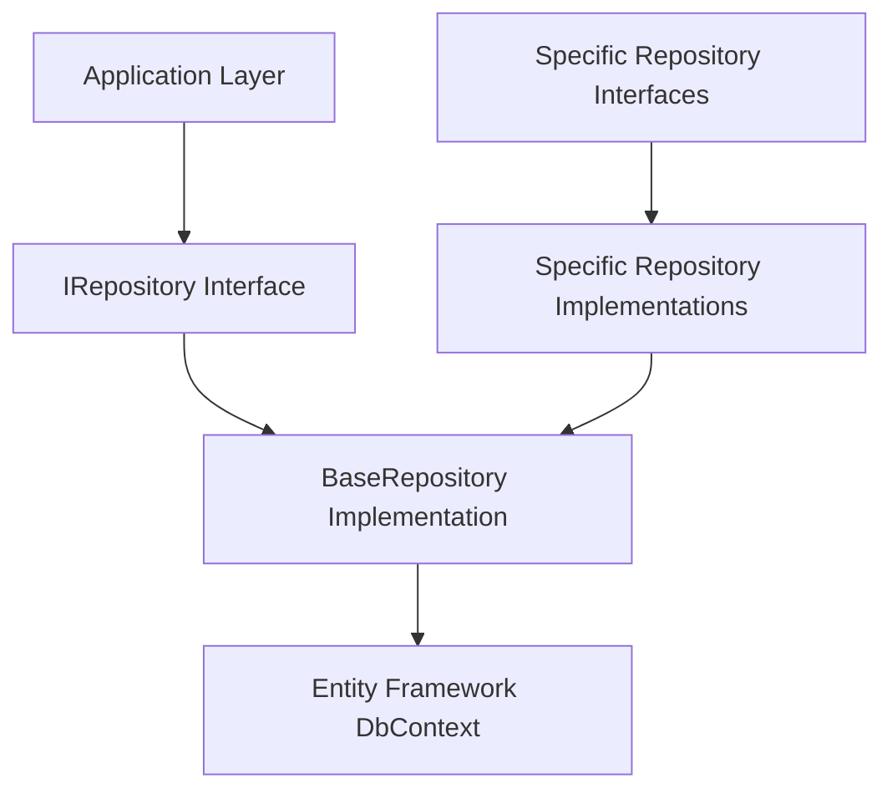

# Data Access Layer

## Panoramica

Il Data Access Layer (DAL) di TaskManager implementa il pattern Repository per fornire un'astrazione pulita tra il dominio dell'applicazione e la persistenza dei dati. Questo approccio offre diversi vantaggi:

- **Separazione delle preoccupazioni**: La logica di business non è accoppiata direttamente all'implementazione del database
- **Testabilità**: I repository possono essere facilmente mockati nei test
- **Manutenibilità**: Le modifiche all'implementazione del database non influenzano il resto dell'applicazione
- **Flessibilità**: È possibile cambiare il sistema di persistenza senza modificare il codice del dominio

## Architettura del Repository Pattern

### Struttura

Il pattern Repository è implementato con le seguenti componenti:

1. **Interfacce del Repository** (Domain Layer):

   - `IRepository<T>`: Interfaccia generica che definisce le operazioni CRUD di base
   - Interfacce specifiche per ogni entità (es. `IProjectRepository`, `ITaskRepository`)

2. **Implementazioni Concrete** (Infrastructure Layer):
   - `BaseRepository<T>`: Implementazione base che fornisce le operazioni CRUD comuni
   - Classi specifiche per ogni entità che estendono `BaseRepository<T>` e implementano le interfacce specifiche

### Diagramma dell'Architettura



## Interfaccia Generica IRepository<T>

L'interfaccia `IRepository<T>` definisce le operazioni CRUD di base disponibili per tutte le entità:

```csharp
public interface IRepository<T> where T : BaseEntity
{
    Task<T?> GetByIdAsync(Guid id);
    Task<IEnumerable<T>> GetAllAsync();
    Task<IEnumerable<T>> FindAsync(Expression<Func<T, bool>> predicate);
    Task AddAsync(T entity);
    Task AddRangeAsync(IEnumerable<T> entities);
    void Update(T entity);
    void Remove(T entity);
    void RemoveRange(IEnumerable<T> entities);
}
```

## Repository Specifici

Ogni entità ha un'interfaccia e un'implementazione specifica che fornisce metodi specializzati per le operazioni comuni su quella entità.

### Esempio: IProjectRepository

```csharp
public interface IProjectRepository : IRepository<Project>
{
    Task<IEnumerable<Project>> GetByOwnerIdAsync(Guid ownerId);
    Task<Project?> GetWithTasksAsync(Guid projectId);
    Task<IEnumerable<Project>> GetPublicProjectsAsync();
}
```

## Implementazione BaseRepository<T>

La classe `BaseRepository<T>` fornisce l'implementazione concreta delle operazioni CRUD di base utilizzando Entity Framework Core:

```csharp
public class BaseRepository<T> : IRepository<T> where T : BaseEntity
{
    protected readonly KanboardDbContext _context;
    protected readonly DbSet<T> _dbSet;

    public BaseRepository(KanboardDbContext context)
    {
        _context = context;
        _dbSet = context.Set<T>();
    }

    public async Task<T?> GetByIdAsync(Guid id) => await _dbSet.FindAsync(id);

    public async Task<IEnumerable<T>> GetAllAsync() => await _dbSet.ToListAsync();

    // ... altre implementazioni
}
```

## Iniezione delle Dipendenze

I repository sono registrati nel contenitore DI nel file `Program.cs`:

```csharp
builder.Services.AddScoped<IProjectRepository, ProjectRepository>();
builder.Services.AddScoped<ITaskRepository, TaskRepository>();
// ... altri repository
```

## Utilizzo nei Servizi dell'Applicazione

I repository vengono iniettati nei servizi dell'applicazione tramite il costruttore:

```csharp
public class ProjectService
{
    private readonly IProjectRepository _projectRepository;

    public ProjectService(IProjectRepository projectRepository)
    {
        _projectRepository = projectRepository;
    }

    public async Task<IEnumerable<Project>> GetProjectsForUserAsync(Guid userId)
    {
        return await _projectRepository.GetByOwnerIdAsync(userId);
    }
}
```

## Best Practices

1. **Mantenere le interfacce semplici**: Le interfacce del repository dovrebbero definire solo i metodi necessari
2. **Evitare query complesse nei repository**: Per query complesse, considerare l'uso di specification pattern o query objects
3. **Gestire le relazioni con attenzione**: Utilizzare `Include` e `ThenInclude` per caricare le relazioni quando necessario
4. **Utilizzare async/await**: Tutti i metodi del repository dovrebbero essere asincroni per evitare blocchi
5. **Gestire le transazioni**: Utilizzare l'interfaccia `IUnitOfWork` per gestire le transazioni su più repository

## Testing

I repository possono essere testati in diversi modi:

1. **Test di integrazione**: Utilizzando un database in-memory per testare l'implementazione concreta
2. **Test unitari**: Utilizzando mock delle interfacce nei servizi dell'applicazione

Esempio di test di integrazione:

```csharp
[Fact]
public async Task GetByIdAsync_WithValidId_ReturnsEntity()
{
    // Arrange
    var context = CreateTestContext();
    var repository = new ProjectRepository(context);
    var projectId = Guid.NewGuid();
    await context.Projects.AddAsync(new Project { Id = projectId, Name = "Test Project" });
    await context.SaveChangesAsync();

    // Act
    var result = await repository.GetByIdAsync(projectId);

    // Assert
    Assert.NotNull(result);
    Assert.Equal("Test Project", result.Name);
}
```

### Testing con MockDbSetHelper

Per testare i repository che utilizzano Entity Framework, il progetto include un helper specializzato che risolve i problemi comuni del mocking di `DbSet<T>`:

```csharp
public class ProjectRepositoryTests : TestBase
{
    private readonly Mock<KanboardDbContext> _mockContext;
    private readonly ProjectRepository _repository;

    public ProjectRepositoryTests()
    {
        _mockContext = new Mock<KanboardDbContext>(new DbContextOptions<KanboardDbContext>());

        // Setup di base per evitare null reference nel costruttore del repository
        var emptyMockDbSet = new Mock<DbSet<Project>>();
        _mockContext.Setup(c => c.Set<Project>()).Returns(emptyMockDbSet.Object);

        _repository = new ProjectRepository(_mockContext.Object);
    }

    [Fact]
    public async Task GetByOwnerIdAsync_WithValidOwnerId_ReturnsProjects()
    {
        // Arrange
        var ownerId = Guid.NewGuid();
        var projects = new List<Project>
        {
            new Project { Id = Guid.NewGuid(), Name = "Project 1", OwnerId = ownerId },
            new Project { Id = Guid.NewGuid(), Name = "Project 2", OwnerId = ownerId }
        };

        var mockDbSet = MockDbSetHelper.CreateMockDbSet(projects);
        _mockContext.Setup(c => c.Set<Project>()).Returns(mockDbSet.Object);

        var repository = new ProjectRepository(_mockContext.Object);

        // Act
        var result = await repository.GetByOwnerIdAsync(ownerId);

        // Assert
        Assert.NotNull(result);
        Assert.Equal(2, result.Count());
        Assert.All(result, p => Assert.Equal(ownerId, p.OwnerId));
    }
}
```

**Vantaggi del MockDbSetHelper:**

- ✅ **Supporto completo per operazioni LINQ asincrone** (`ToListAsync`, `FirstOrDefaultAsync`, `Where`, `OrderBy`)
- ✅ **Risoluzione degli errori `System.NotSupportedException`** comuni nel mocking di Entity Framework
- ✅ **Implementazione corretta di `IAsyncQueryProvider`** e `IAsyncEnumerable<T>`
- ✅ **Test affidabili e manutenibili** per tutti i tipi di query repository

### Pattern di Test Implementato

Il progetto ha raggiunto **100% di successo** nei repository tests utilizzando questo pattern:

- **BaseRepositoryTests**: 9/9 test ✅
- **UserRepositoryTests**: 4/4 test ✅
- **ProjectRepositoryTests**: 3/3 test ✅
- **TaskRepositoryTests**: 4/4 test ✅
- **ColumnRepositoryTests**: 2/2 test ✅
- **BoardRepositoryTests**: 2/2 test ✅

**Totale: 24 repository tests, 100% pass rate**

### Best Practices per Repository Testing

1. **Setup corretto del context mock** nel costruttore per evitare null reference
2. **Utilizzo di MockDbSetHelper** per test che richiedono query LINQ
3. **Configurazione specifica per ogni test** invece di setup globale
4. **Gestione dei namespace conflicts** con alias (`SystemTask`, `DomainTask`)
5. **Test di scenari positivi e negativi** per coverage completa
